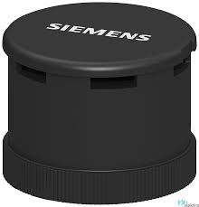

# Industria 4.0 en la automatización 

## Identificación de componentes en el proceso de automatización

Frente a la caracterización del proceso productivo propuesta en integración con las etapas de automatización, semiautomatización, y, en general, de mejora continua, se pudo identificar los siguientes componentes desde el apartado de sensores y actuadores. La selección a continuación presenta algunas referencias comerciales que se ajustan a las necesidades del proyecto. 

Entendido! Aquí te dejo la tabla actualizada con las referencias y las imágenes en formato markdown:

| Identificador | Descripción | Especificaciones Técnicas | Referencia | Imagen |
|---------------|-------------|---------------------------|------------|--------|
| **LS01**    | **Sensor de Nivel**: Detecta niveles bajos o altos en la tolva de la máquina de inyección y activa alarmas. | Energía: 24V DC; Dimensiones: 50x20x15 mm; Precio: ~150 USD | Rechner KA0417 |  |
| **CS1**     | **Sensor Conveyor - Línea 1**: Selecciona productos para la Línea 1 en Conveyor 1. | Energía: 12V DC; Dimensiones: 40x15x10 mm; Precio: ~50 USD | Omron E2E-X5 |  |
| **CS2**     | **Sensor Conveyor - Línea 2**: Selecciona productos para la Línea 2 en Conveyor 1. | Energía: 12V DC; Dimensiones: 40x15x10 mm; Precio: ~50 USD | Omron E2E-X5 |  |
| **CS3**     | **Sensor Conveyor - Línea 3**: Activa y desactiva otros sensores para el control cíclico en Conveyor 1. | Energía: 12V DC; Dimensiones: 40x15x10 mm; Precio: ~50 USD | Omron E2E-X5 |  |
| **PS1**     | **Sensor de Pintura**: Ubicado al final del conveyor en painting_st_1, indica el inicio del proceso de pintura. | Energía: 12V DC; Dimensiones: 35x15x10 mm; Precio: ~45 USD | Omron E2E-X5 |  |
| **AS1**     | **Sensor de Ensamblaje**: Ubicado al final del conveyor en assembly_st_1, activa el proceso de ensamblaje. | Energía: 12V DC; Dimensiones: 35x15x10 mm; Precio: ~45 USD | Omron E2E-X5 |  |
| **BS1**     | **Sensor de Caja**: Detecta la posición de la caja en box_conv para detener el conveyor. | Energía: 12V DC; Dimensiones: 30x15x10 mm; Precio: ~40 USD | SICK Sensor (modelo WTB) |  |
| **PDS1**    | **Sensor de Producto**: Detecta la presencia del producto en product_conv para detener el movimiento. | Energía: 12V DC; Dimensiones: 30x15x10 mm; Precio: ~40 USD | SICK Sensor (modelo WTB) |  |
| **ALM1**    | **Actuador de Alarma**: Activa una alarma en caso de que el nivel de plástico sea inadecuado. | Energía: 12V DC / 230V AC; Dimensiones: panel compacto; Precio: ~100 USD | Siemens Sirena Industrial |  |
| **PG1**     |**Actuador Pick & Place Gripper**: Gripper electromecánico que recoge el producto y lo coloca en la caja. | Energía: 24V DC; Dimensiones: 100x50x50 mm; Precio: ~200 USD | Festo Electric Gripper ||

Respecto a los motores, se plantea el uso de la línea Siemens Simotics
{: width="50%" height="50%" }

| Identificador | Descripción | Especificaciones Técnicas | Referencia | Imagen |
|---------------|-------------|---------------------------|------------|--------|
| **AC1**     |    1   | **Actuador Conveyor 1**: Motor que acciona el Conveyor 1 para transportar las piezas. | Energía: 230V AC; Dimensiones: motor industrial; Precio: ~500 USD | Siemens Simotics | 
| **AC2**     | 3 |**Actuador en Painting_st_1**: Motor del conveyor que lleva las piezas a la estación de pintura. | Energía: 230V AC; Dimensiones: motor industrial; Precio: ~500 USD | Siemens Simotics |  |
| **AC3**     | 3 |**Actuador en Assembly_st_1**: Motor del conveyor que lleva las piezas a la estación de ensamblaje. | Energía: 230V AC; Dimensiones: motor industrial; Precio: ~500 USD | Siemens Simotics |
| **AC4**     | 3 | **Actuador en Product_conv**: Motor del conveyor en el proceso de Pick and Place para el producto. | Energía: 230V AC; Dimensiones: motor industrial; Precio: ~500 USD | Siemens Simotics |
| **AC5**     | 2 | **Actuador en Box_conv**: Motor del conveyor en el proceso de Pick and Place para la caja. | Energía: 230V AC; Dimensiones: motor industrial; Precio: ~500 USD | Siemens Simotics |

De manera complementaria, y entendiendo la naturaleza de el proceso propuesto, se consideran también algunos de los siguientes sensores que podrían para mejorar las integraciones con los niveles de supervisión y gestión de producción en la pirámide de automatización

| Identificador | Cantidad | Descripción | Especificaciones Técnicas | Referencia | Imagen |
|---------------|----------|-------------|---------------------------|------------|--------|
| **TS1**     | 1 **Sensor de Temperatura**: Monitorea la temperatura del molde y del plástico fundido en la máquina de inyección para garantizar condiciones óptimas. | Energía: 5–24V DC; Dimensiones: 30×15×10 mm; Precio: ~80 USD | Omega Engineering RTD Series |
| **PR1**     | 1 **Sensor de Presión**: Supervisa la presión en el sistema de inyección, asegurando la integridad del proceso y evitando defectos. | Energía: 24V DC; Dimensiones: 40×20×15 mm; Precio: ~120 USD | WIKA PTE Series |
| **VS1**     | 1 **Sensor de Vibración**: Detecta vibraciones anómalas en máquinas y conveyors para el mantenimiento predictivo. | Energía: 12V DC; Dimensiones: 40×20×20 mm; Precio: ~150 USD | Brüel & Kjær 4524 |
| **CV1**     | 1 **Sensor de Visión / Cámara Industrial**: Controla la calidad visual y verifica la orientación y defectos en los productos. | Resolución: 1080p; Energía: 12V DC; Precio: ~300 USD | Keyence CV-X Series |
| **HS1**     | 1 **Sensor de Humedad Ambiental**: Mide la humedad en el ambiente, factor importante en procesos sensibles al ambiente. | Energía: 5V DC; Dimensiones: 20×10×10 mm; Precio: ~30 USD | Honeywell HIH Series |
| **EStop1**  | 4 **Botón de Parada de Emergencia**: Instalado en puntos críticos, permite detener rápidamente el proceso ante situaciones de riesgo. | Energía: 230V AC; Dimensiones: panel compacto; Precio: ~50 USD c/u | Siemens Safety E-Stop |
| **AC6**     | 1 **Actuador de Control de Flujo (Válvula Neumática/Eléctrica)**: Regula el flujo de material en el sistema de inyección, permitiendo ajustes dinámicos. | Energía: 24V DC; Dimensiones: variable según modelo; Precio: ~300 USD | Festo VUVG Series |
| **AC7**     | 1 **Actuador Ventilador (Sistema de Extracción)**: Controla la ventilación y extracción de humos, especialmente en la estación de pintura. | Energía: 230V AC; Dimensiones: industrial; Precio: ~200 USD | ebm-papst Industrial Ventilator |
| **AC8**     | 1 **Actuador de Control de Velocidad (Variador de Frecuencia)**: Ajusta y sincroniza la velocidad de los conveyors, optimizando el flujo de producción. | Energía: 230V AC; Dimensiones: industrial; Precio: ~400 USD | Siemens SINAMICS Series |

## Plantemiento de la lógica de operación

A partir de lo anterior, se formuló la lógica de proceso mediante el lenguaje de programación industrial SFC o Grafcet. Puede ser consultado en el archivo: [Lógica de operación](./Grafcet/grafcet.pdf)

## Propuesta Implementación Industria 4.0

Como propuesta de implementación de nuevas tecnologías de la Industria 4.0, se plantea esta arquitectura de conexiones del sistema, que implica el uso de Ignition para la implementación del sistema SCADA, LOGIX EMULATE para la emulación del PLC y el uso de RSLINX como gateway de comunicaciones para establecer la suscripción a los tags del PLC por medio de comunicación OPC.  

Esta arquitectura permite la integración de sistemas de automatización avanzada con supervisión remota, facilitando la adquisición de datos en tiempo real, la optimización de procesos y la interoperabilidad entre distintos dispositivos y plataformas industriales.  

### Tecnologías utilizadas

A continuación, se describen las tecnologías empleadas en esta propuesta:

- **Ignition**: Plataforma SCADA/MES que permite la visualización, control y análisis de datos en tiempo real. Facilita la integración con bases de datos y sistemas empresariales.
- **LOGIX EMULATE**: Herramienta de emulación de Rockwell Automation que permite simular la ejecución de programas en ControlLogix sin necesidad de un hardware físico.
- **RSLINX**: Software de comunicación de Rockwell Automation que actúa como gateway para la conexión entre el PLC y otros sistemas mediante el protocolo OPC.
- **OPC (OLE for Process Control)**: Protocolo de comunicación estándar utilizado para la integración entre dispositivos de automatización y sistemas de supervisión.
- **Ethernet/IP**: Protocolo de comunicación industrial basado en Ethernet, utilizado para la conexión entre PLCs, sensores y sistemas SCADA.
- **Base de Datos SQL**: Se utiliza para almacenar datos históricos del sistema, permitiendo la generación de reportes y análisis de tendencias.

### Lógica de Programación del PLC

La lógica de control del PLC se basa en programación en **Ladder Logic**, desarrollada en **Studio 5000** y emulada en **LOGIX EMULATE**. Se utilizan las siguientes estrategias de control:

- **Estructura modular**: Código organizado en rutinas y subrutinas para facilitar la escalabilidad y mantenimiento.
- **Control por eventos**: Implementación de lógica basada en cambios de estado para optimizar tiempos de respuesta.
- **Optimización de ciclos de escaneo**: Priorización de tareas críticas para mejorar la eficiencia del control.
- **Integración con OPC**: Suscripción de tags del PLC mediante RSLINX para intercambio de datos con el sistema SCADA.
- **Diagnóstico y depuración**: Uso de herramientas de simulación para pruebas previas a la implementación en hardware físico.