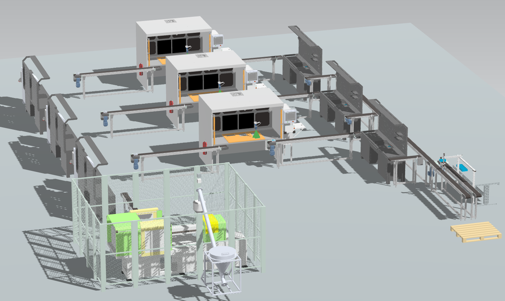

# Fábrica Digital
De cara a las integraciones tecnológicas que permiten, con practicidad, entender de manera 

A continuación se aprecia en video el proceso productivo simplificado en donde se incorporan las etapas que, dentro de la formulación de la automatización, dieron pie a la propuesta actual, como se ve en la siguiente figura.

Para llegar a esta punto, se hizo un desglose por etapas mediante el que se determinaron los sensores y actuadores que se debían 

[Video de simulación de la planta en NX](https://youtu.be/VLOkGwhd2TY)