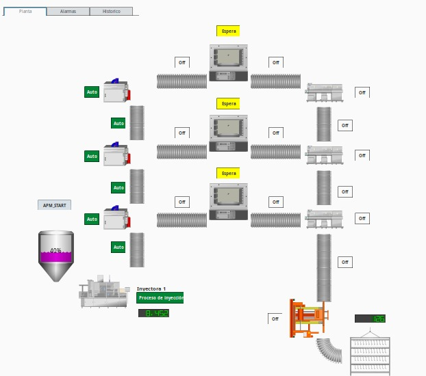

## Implementación del SCADA

El sistema SCADA implementado en **Ignition** permite la supervisión, control y análisis en tiempo real de los procesos industriales. Esta solución facilita la integración con diferentes dispositivos y protocolos de comunicación, proporcionando una interfaz gráfica centralizada para la operación del sistema.

### Características del SCADA

- **Monitoreo en tiempo real**: Visualización en vivo de variables clave del proceso.
- **Registro de datos históricos**: Almacenamiento en una base de datos SQL para análisis y generación de reportes.
- **Gestión de alarmas**: Configuración de alertas para condiciones críticas del sistema.
- **Interfaz personalizable**: Diseño de paneles con gráficos dinámicos e indicadores clave de rendimiento (KPIs).
- **Conectividad con PLC**: Integración con **RSLINX** mediante el protocolo **OPC** para intercambio de datos.

### Arquitectura del SCADA

El SCADA se comunica con el PLC a través de RSLINX, utilizando OPC como protocolo de comunicación para la adquisición de datos en tiempo real. Además, la información se almacena en una base de datos SQL para su posterior análisis.

La interfaz HMI del SCADA incluye la visualización del estado de activación de las diferentes estaciones, asi como el accionamiento de las bandas transportadoras. Tambien se pueden registrar algunas alarmas, por ejemplo del nivel de la tolva de la inyectora de plastico.